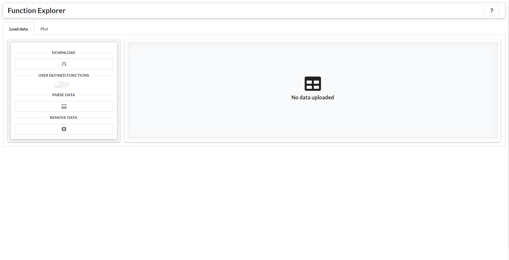
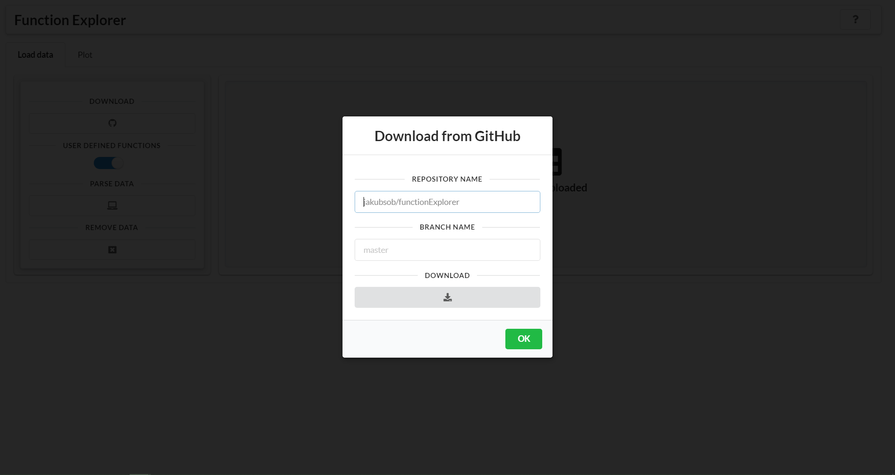
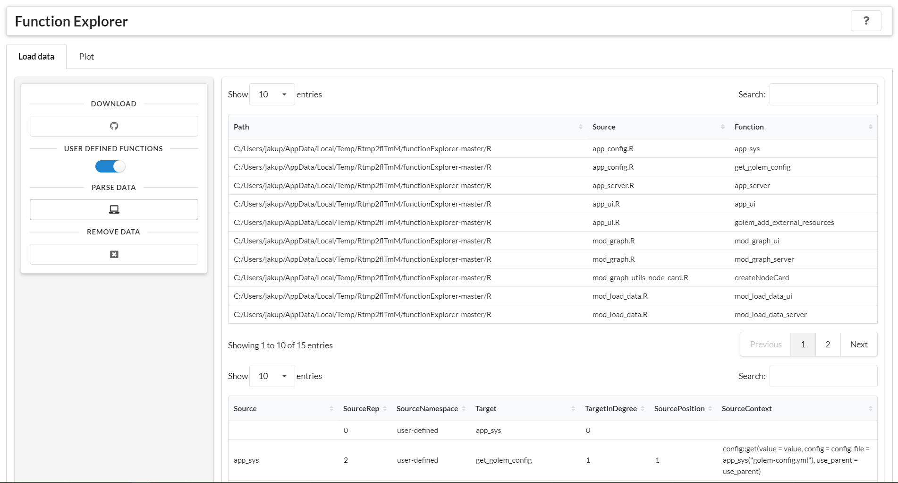
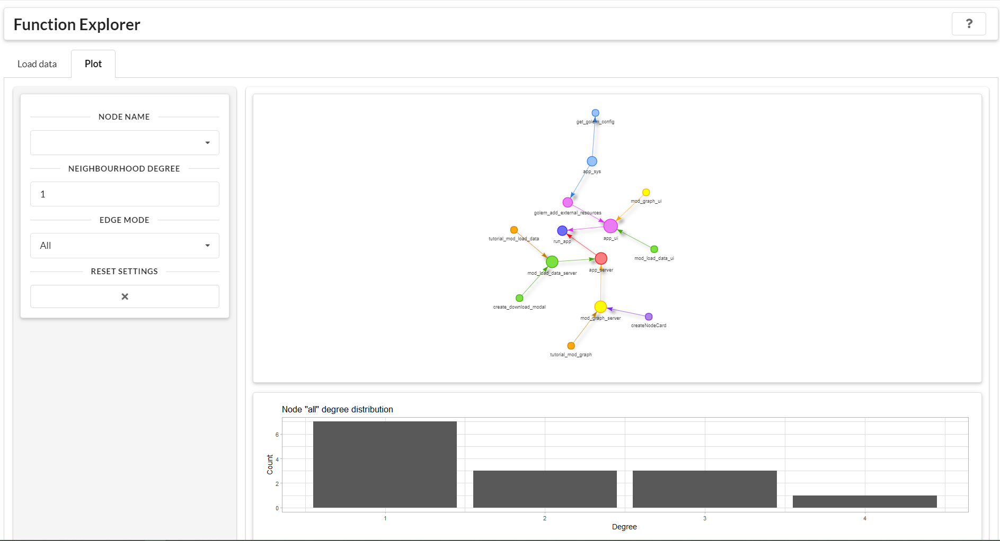
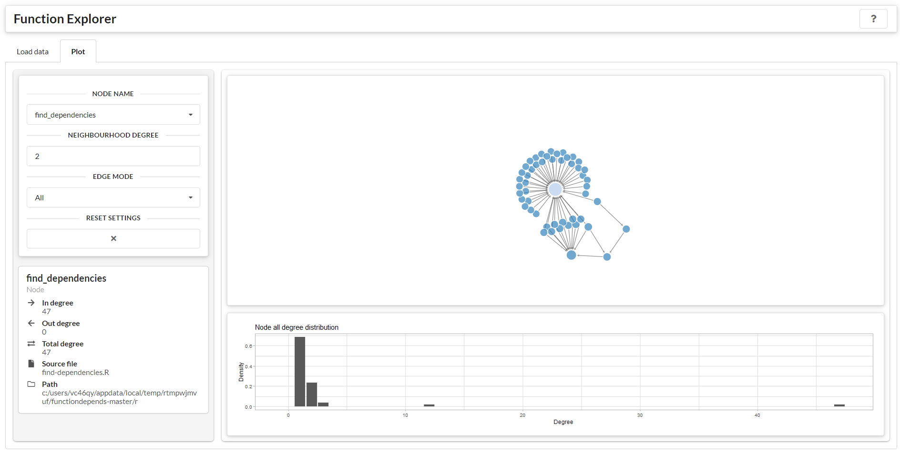

<!-- README.md is generated from README.Rmd. Please edit that file -->

```{r, include = FALSE}
knitr::opts_chunk$set(
  collapse = TRUE,
  comment = "#>",
  fig.path = "man/figures/README-",
  out.width = "100%"
)
```

# functionExplorer

<!-- badges: start -->
[](https://github.com/jakubsob/functionExplorer/actions)
[](https://choosealicense.com/)
[](https://www.tidyverse.org/lifecycle/#experimental)
<!-- badges: end -->

An app for exploring dependencies between functions from selected GitHub repository.

## Installation

Install from GitHub:

```{r, eval = FALSE}
devtools::install_github("jakubsob/functionExplorer")
```

and run:

```{r, eval = FALSE}
functionExplorer::run_app()
```

## User Interface

```{r, echo = FALSE, fig.cap = "Start page of app."}

```

```{r, echo = FALSE, fig.cap = "Data downloading popup."}

```

```{r, echo = FALSE, fig.cap = "Tables with loaded and parsed data."}

```

```{r, echo = FALSE, fig.cap = "Function dependencies network."}

```

```{r, echo = FALSE, fig.cap = "Function dependencies network with selected node."}

```
